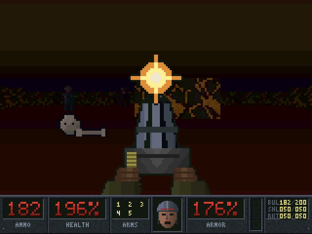
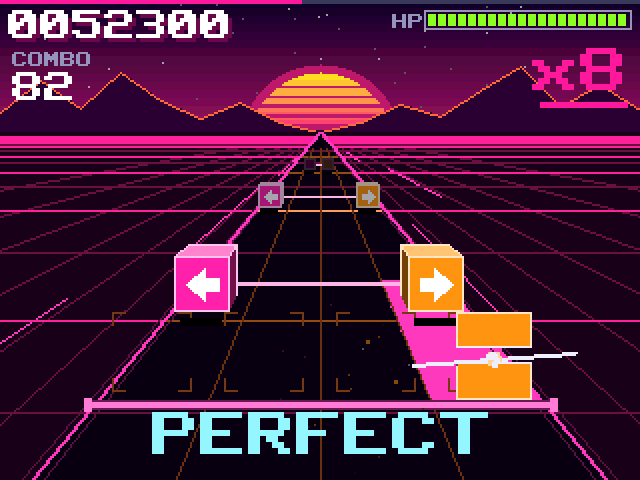

# TI-84 Plus CE games

Original games for the **TI-84 Plus CE** graphing calculator (also the
TI-84 Plus CE Python and TI-83 Premium CE), written in C and eZ80 assembly.
Every game here comes with a ready-to-send download, the libraries it needs,
the full source code, screenshots and an install guide.

| | Game | |
|:-:|---|---|
|  | **[DREAD](dread)** — a first-person shooter in the spirit of the 90s classics: five levels, four kinds of monsters, five weapons, keycards, secrets, an automap and a final boss. | **[Download DREAD.zip](downloads/DREAD.zip)** |
|  | **[Neon Slice](neon-slice)** — a neon rhythm game: slice the cubes flying down a pseudo-3D highway on the beat, dodge the bombs, chase an S rank on five stages. | **[Download NeonSlice.zip](downloads/NeonSlice.zip)** |

## Quick start

1. Download a game's zip from the table above and unzip it.
2. Connect your calculator with [TI Connect CE](https://education.ti.com/en/products/computer-software/ti-connect-ce-sw)
   and send **every file** in the zip to it (including `clibs.8xg` the
   first time).
3. Run the game from [Cesium](https://github.com/mateoconlechuga/cesium/releases).

New to calculator games, on OS 5.5 or newer, or seeing a memory error? The
**[install guide](INSTALLING.md)** covers everything step by step.

## What's in this repository

```
dread/          DREAD: source, tools, docs, screenshots, release/ (calculator files)
neon-slice/     Neon Slice: source, tools, PC preview, screenshots, release/
downloads/      one zip per game: its calculator files + clibs.8xg + install notes
libraries/      clibs.8xg, the CE C libraries both games need (with its license)
INSTALLING.md   how to install and run the games, and troubleshooting
```

Each game's folder has its own README with controls, how it plays, how to
build it and how it works.

## Building from source

Both games build with the [CE C toolchain](https://github.com/CE-Programming/toolchain)
(CEdev v15). DREAD also needs Python 3 with Pillow and numpy, because its
art, levels and data tables are generated by scripts. See
[dread/README.md](dread/README.md#building) and
[neon-slice/README.md](neon-slice/README.md#building).

## Credits and license

The games, their art and their code are by Chasemightcode and released
under the [MIT license](LICENSE).

They are built with the CE C toolchain and use the CE libraries (GraphX,
KeypadC, FileIOC, LibLoad) by the [CE-Programming](https://github.com/CE-Programming)
team. `libraries/clibs.8xg` is their unmodified release, redistributed under
its [BSD-2-Clause license](libraries/LICENSE).
