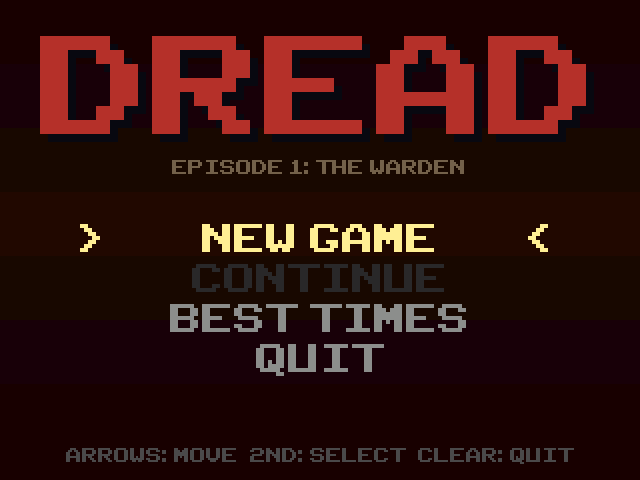
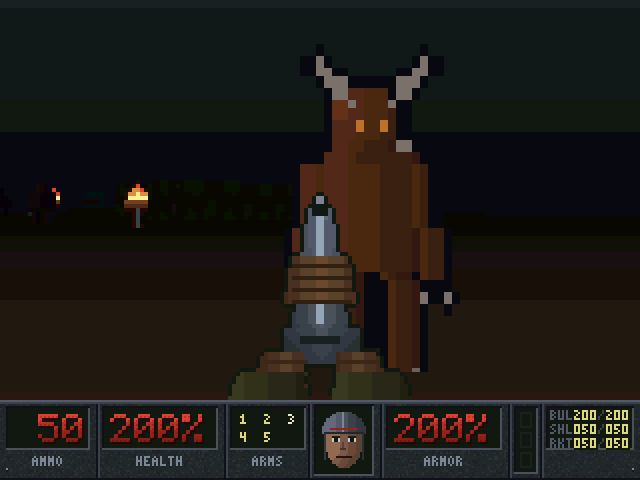
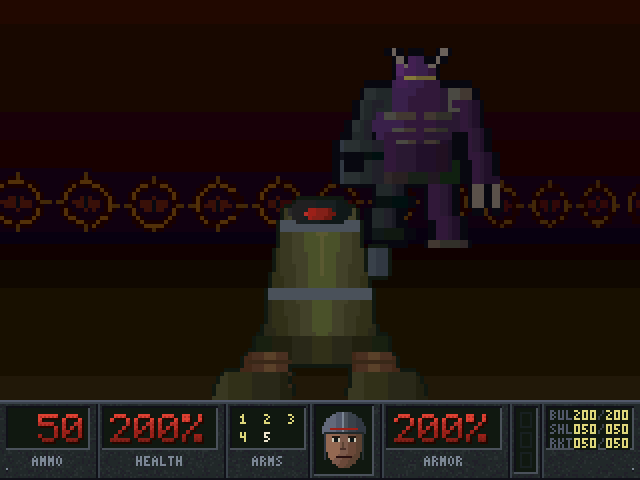
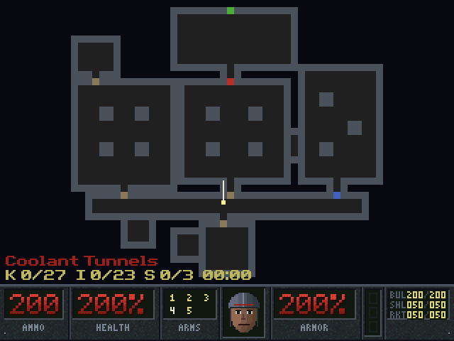
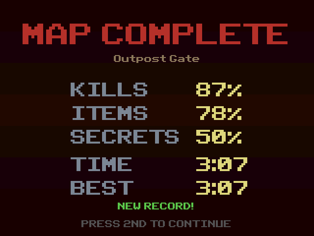

# DREAD

A first-person shooter for the TI-84 Plus CE in the spirit of the 90s
classics: five levels, four kinds of monsters, five weapons, keycards,
secrets and a final boss. Written in C and eZ80 assembly with the CE C
toolchain. Every name, texture, sprite, level and line of code is original.

**Version 1.0** — see the [changelog](CHANGELOG.md).

| | | |
|:-:|:-:|:-:|
|  |  |  |
|  |  |  |

## Download and install

Download **[DREAD.zip](../downloads/DREAD.zip)** (everything below plus the
libraries), or take the files from [`release/`](release):

| File          | What it is                                          |
|---------------|-----------------------------------------------------|
| `DREAD.8xp`   | the game program                                    |
| `DREADTX.8xv` | palette + 21 wall textures                          |
| `DREADSP.8xv` | item/decoration sprites + status bar art            |
| `DREADEN.8xv` | enemy, boss, projectile and effect sprites          |
| `DREADWP.8xv` | first-person weapon frames                          |
| `DREADL1.8xv` … `DREADL5.8xv` | the five levels                     |

Send **all ten** to the calculator with TI Connect CE, plus
[`clibs.8xg`](../libraries) (the CE C libraries) if no other C game runs on
your calculator yet. Then run **DREAD** from Cesium. The
[install guide](../INSTALLING.md) walks through it step by step, including
how to get Cesium on newer calculators and what to do about memory errors.

DREAD needs about **75 KB of free RAM** while it runs: the program itself is
copied into RAM (47 KB) plus 25 KB of work space (a temporary `DREADTMP`
AppVar, deleted on exit). Keep your other programs archived. If an AppVar is
missing or RAM is short, DREAD says so and exits. Progress and best times
are kept in a small `DREADSV` AppVar, archived when you quit.

## Controls

| Key                  | Action                               |
|----------------------|--------------------------------------|
| Up / Down            | move forward / back                  |
| Left / Right         | turn                                 |
| Alpha + Left / Right | strafe                               |
| Alpha                | use: open doors, secret walls, exit switch |
| 2nd                  | fire (hold for repeat fire)          |
| 1 2 3 4 5            | fists, pistol, scattergun, rotary cannon, rocket launcher |
| Y=                   | automap on / off                     |
| Enter                | pause menu: resume, restart map, quit to title |
| Mode                 | show / hide the FPS counter          |
| Clear                | quit DREAD, from anywhere            |

In menus: Up/Down move, 2nd or Enter select. When you die, press 2nd to
restart the map with what you carried into it. A weapon key only works once
you have picked that weapon up.

## The episode

1. **Outpost Gate** — a small tech outpost: learn the ropes, find the
   scattergun.
2. **Coolant Tunnels** — pump rooms and coolant tanks; heavy troopers and the
   rotary cannon.
3. **Stone Keep** — a castle courtyard and towers; brutes and the rocket
   launcher.
4. **Flesh Works** — a hellish cavern, a flesh maze, a sigil temple.
5. **The Warden's Pit** — supply caves, two chapels and the arena where the
   Warden waits.

Every map has keycards to find (red, blue, yellow doors) and two or three
secrets. Finishing a map shows the tally (kills %, items %, secrets %, time
and your best time) and saves: *Continue* on the title page resumes at the
next map with the health, armor, weapons and ammo you had. Best times are
kept per map and difficulty (*Best times* on the title page).

**Difficulty:** *Easy* has fewer monsters, halves the damage you take and
doubles ammo pickups; *Hard* adds monsters and makes their hits 25% harder.

## Features

**Stage 1 — engine**
- Raycaster at 160×100 logical pixels drawn as 2×2 blocks (320×200), with a
  40-pixel status bar below.
- 21 original procedural 32×32 wall textures (tech, stone, brick, metal,
  hell, doors, exit switch), 16-level distance shading, darker east/west
  faces, matching ceiling/floor gradient.
- Collision with wall sliding; fixed 35 Hz game tics independent of frame
  rate; double buffering.

**Stage 2 — doors, pickups, status bar**
- Sliding doors: a slab through the middle of the cell that slides into the
  wall, drawn inside the assembly ray caster; door-frame texture on the
  doorway sides; closes by itself after 3 seconds unless something is in the
  way.
- Red, blue and yellow keycard doors ("You need the red keycard.").
- Secret doors: flush walls with the surrounding texture that slide open
  when used and count toward the level's secrets.
- Things as billboard sprites clipped against the per-column depth buffer:
  stimpack, medkit, vital orb, combat vest, heavy plate, ammo (clips,
  boxes, shells, rockets), three keycards, three weapon pickups, and
  decorations (lamp, pillar, barrel, blood, bones, brazier). Lamps,
  keycards, braziers and the orb stay full-bright in the dark.
- Pickup rules like the classics: health isn't taken at full health, armor
  only if it's better, ammo up to each type's maximum, weapons give ammo and
  switch to themselves.
- Full status bar: ammo, health %, arms (owned in yellow, selected in white),
  a face with 5 damage stages that glances around, armor %, keycards, and an
  ammo table. Only changed parts are redrawn.
- Pickup messages and a yellow screen flash (palette tint).

**Stage 3 — enemies and combat**
- Four original creatures, each with walk, windup, attack, pain, three
  death frames and a corpse:
  - **grunt**: weak (20 hp), single hitscan shots;
  - **heavy trooper**: 50 hp, fires 3-shot bursts;
  - **imp**: 40 hp, throws fireballs you can see coming and sidestep, and
    claws when it is next to you;
  - **brute**: slow, 150 hp, charges when it sees you and hits for 15-35 up
    close.
- AI: idle until it sees you (grid line-of-sight) or hears gunfire (sound
  spreads through each area and through doors that are at least half
  open), then chases DOOM-style in 8 directions, opens unlocked doors,
  attacks at range with line-of-sight checks (farther shots miss more),
  flinches when hit, plays its death animation and leaves a corpse.
- Hits leave blood; misses leave a puff on the wall. Fireballs explode on
  walls.
- Damage: armor absorbs a third (vest) or half (plate) while its points
  last; the screen flashes red, the face winces; at 0 health you die.

**Stage 4 — weapons**

| Key | Weapon | Ammo | Rate | Damage |
|-----|--------|------|------|--------|
| 1 | fists | none | 2.2/s | 2-20, melee, silent |
| 2 | pistol | bullets | 2.9/s | 5-15, hitscan; held fire spreads a little |
| 3 | scattergun | shells | 1.3/s | 7 pellets x 5-15 over a wide cone: huge up close |
| 4 | rotary cannon | bullets | 8.75/s | 5-15, hitscan, small spread |
| 5 | rocket launcher | rockets | 1.75/s | 30-80 on impact + blast up to 128 |

- Bullets and pellets are hitscan; rockets are visible projectiles that
  explode on walls, monsters and solid decorations. The blast reaches 1.75
  tiles, falls off with distance, needs a clear line to its target and
  hurts you too if you fire point-blank.
- Every weapon has its own first-person art with idle, firing (muzzle flash)
  and recoil/pump frames; the cannon's barrels turn shot by shot. Firing a
  gun also lights up the room for a moment. The weapon bobs while you walk.
- Weapons lower and raise when you switch; running dry switches to the best
  weapon that still has ammo.

**Stage 5 — the episode**
- Five levels from 40×32 to 60×60 cells, 11 to 50 monsters depending on the
  map and difficulty; every level is checked at build time (keycards
  reachable in order, every thing reachable, a reachable exit).
- **The Warden**, the final boss: 1200 hp, drawn two tiles tall, fires
  volleys of three rockets with splash damage and stomps you up close. The
  episode ends when it dies.
- Title page (New Game, Continue, Best times, Quit), difficulty select,
  pause menu, end-of-map tally that counts up, victory page.
- **Automap** (Y=): every wall the view has shown and every cell you walked
  through, doors in their keycard colors, your position and heading, and
  the map's kills/items/secrets/time.
- **Saves** in `DREADSV`: the run in progress (map, difficulty, loadout),
  best times per map and difficulty, and which difficulties you have won.

## Performance

The hot paths are hand-written eZ80 assembly in `src/raycast.s`:

- **Ray casting.** A grid DDA in Q12 fixed point, with ray reciprocals from
  a 2048-entry normalized table instead of division. Each grid step costs
  about 15 bytes of code; door cells branch to a slower path that tests the
  slab and resumes the walk. Walls a ray hits are marked for the automap.
- **Wall columns.** Texture coordinates live in the shadow registers. Each
  logical pixel is one 11-byte unrolled block (fetch, shade, write 2 bytes).
- **Sprites.** A gather pass transforms and culls every thing within 24
  tiles, splitting signs from magnitudes so each product is three 8×8
  `mlt`s; things in the rear quadrant are dropped before any multiply. Each
  sprite is trimmed to its opaque bounding box and to the columns not
  hidden behind walls, then drawn with 15-byte blocks that skip transparent
  texels. Close-up sprites (a texel two or more columns wide) draw two
  columns per texel fetch.
- **First-person weapon.** RLE-compressed frames drawn straight from the
  archive into the view's even rows.
- **Ceiling/floor.** Filled only where no wall covers the row, 3 bytes per
  `push`. **Vertical doubling** copies each even row down with `ldir`.

The C game logic is written around the compiler's `-Oz` output: tables are
padded to power-of-two strides (indexing odd sizes costs a library
multiply), loops walk pointers, only monsters, missiles and effects are on
the per-tic thinker list, pickups and collisions use per-cell lists, and a
chasing monster thinks every other tic with doubled steps.

On the cycle-counting emulator (see below) a frame costs about 1.7–2.0M
cycles while exploring (**about 24–28 FPS**) and 1.9–2.2M in a fight with a
dozen monsters awake on the biggest map (**about 22–25 FPS**). Real hardware
timing may differ; the FPS number in the corner is the real measurement, so
please report what you see.

## Building

Requirements: the [CE C toolchain](https://github.com/CE-Programming/toolchain)
(CEdev v15, in `~/CEdev` or pointed to by `CEDEV`) and Python 3 with Pillow
and numpy.

```bash
python build.py
```

That runs everything: art generation → level compile and checks →
convimg/convbin → `make` → the IX safety check, and copies the calculator
files to `release/`. `src/gen/` and `src/gfx/` are generated by this step,
so run `build.py` (not just `make`) after a fresh clone.

### Making levels

Levels are ASCII files in `levels/` (`e1m1.txt` … `e1m5.txt`). Walls are
uppercase letters or symbols (`#` tech panel, `S` stone, `B` brick, `M`
metal, `L` lava rock, ... see `tools/levels.py`), `D`/`R`/`U`/`Y` are
normal/red/blue/yellow doors (they need walls on both sides along one axis),
`X` is the exit switch, and `> v < ^` is the player start. Secret doors are
declared in the level's legend, e.g. `$ = secret stone_gray`. A level with
`boss: yes` in its header ends when the boss dies. Things are lowercase
letters:

| char | thing | char | thing | char | thing |
|------|-------|------|-------|------|-------|
| `s` | stimpack | `c` | clip | `k` | red keycard |
| `m` | medkit | `n` | box of bullets | `j` | blue keycard |
| `o` | vital orb | `e` | 4 shells | `y` | yellow keycard |
| `a` | combat vest | `f` | box of shells | `g` | scattergun |
| `b` | heavy plate | `r` | rocket | `u` | rotary cannon |
| `t` | lamp | `q` | crate of rockets | `l` | rocket launcher |
| `p` | pillar | `w` | barrel | `i` | brazier |
| `d` | blood | `z` | bones | | |

Monsters are digits and symbols, which also choose the difficulties they
appear on:

| grunt | heavy | imp | brute | appears on |
|-------|-------|-----|-------|------------|
| `1` | `2` | `3` | `4` | every difficulty |
| `5` | `6` | `7` | `8` | Normal and Hard |
| `!` | `@` | `&` | `*` | Hard only |

`9` is the boss. Thing definitions live in `tools/things.py`, which also
generates the C tables, so the compiler and the game always agree. The
build rejects a level whose keycards, things or exit can't be reached.
`tools/level_design/` holds the script that first laid the five maps out
from rectangles; `levels/test_map.txt` is the engine test map the emulator
tests use in place of level 1 (not released). Overview images of every map
are in [`art/`](art).

### Layout

```
src/            C and assembly sources
  main.c        title -> campaign -> victory, the main loop, input, timing
  menu.c        title, difficulty, pause, tally, victory and message pages
  automap.c     the automap
  save.c        DREADSV: progress, loadout, best times
  render.c      per-level / per-frame renderer setup, muzzle light
  raycast.s     eZ80 core: ray cast, walls, doors, sprites, gather, weapon, row copy
  sprites.c     sprite projection, sorting, texel cache
  doors.c       door table and state machines
  things.c      spawning, thinker list, pickups, blockmap
  monsters.c    monster AI (and the boss), line of sight, hearing
  combat.c      weapons, hitscan, player damage, missiles, effects
  player.c      movement, collision, use
  hud.c         status bar, messages, screen flashes
  arena.c       large buffers in free user RAM
  level.c       level AppVar loading
  assets.c      texture/palette AppVar loading
  gen/ gfx/     generated by build.py (not in the repository)
levels/         ASCII level sources (e1m1..e1m5, test_map)
tools/          art and asset pipeline, level compiler, build checks
  level_design/ the script that laid out the five maps
  emu/          eZ80 interpreter + CE harness: tests, profiling, screenshots
art/            previews: textures, sprites, enemies, weapons, map overviews
docs/           developer guide
screenshots/    the pictures in this README
release/        files to send to the calculator
```

## Developing

[docs/DEVELOPMENT.md](docs/DEVELOPMENT.md) explains how the engine works,
how to add monsters, weapons, textures and levels, the memory layout, the
test harness, performance numbers, and the toolchain pitfalls that cost the
most time.

DREAD is tested without a calculator: `tools/emu/` runs the real compiled
program on an eZ80 interpreter with stand-ins for the calculator's
libraries.

```bash
python tools/emu/test_render.py     # depth buffer vs float raycaster
python tools/emu/test_sprites.py    # thing transform/culling vs float math
python tools/emu/test_game.py       # doors, pickups, monsters, combat, weapons (~15 min)
python tools/emu/test_campaign.py   # menus, automap, pause, saves, Continue, boss, difficulty
python tools/emu/perf_game.py "40.5,7.5,180" 60 3   # frame cost of a live fight
python tools/emu/screenshots.py     # regenerate screenshots/
```

## Credits and license

DREAD is by Chasemightcode, released under the [MIT license](../LICENSE).
It uses the [CE C toolchain](https://github.com/CE-Programming/toolchain)
and the [CE libraries](https://github.com/CE-Programming/libraries) (GraphX,
KeypadC, FileIOC) by the CE-Programming team. `tools/emu/gfx_font.py` is
GraphX's font data from the toolchain (LGPL-3.0), used only to draw text in
test screenshots.
