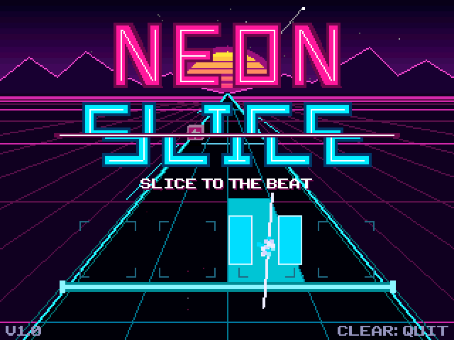
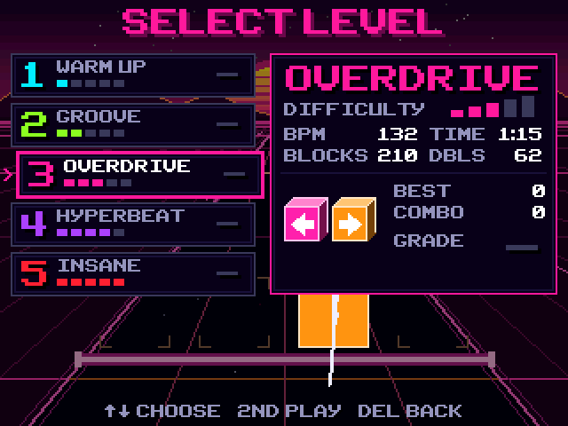
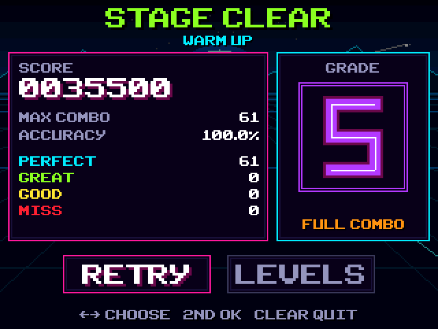

# Neon Slice

A neon rhythm game for the TI-84 Plus CE. Cubes fly down a pseudo-3D highway
toward a glowing hit line; slice each one with the matching arrow key right
on the beat. The calculator has no speaker, so the rhythm is visual: the sky,
grid, lane lines and hit line all pulse on every beat.

| | |
|:-:|:-:|
|  |  |
|  |  |

Program name: `SLICE` (about 38 KB).

## Installing

Download **[NeonSlice.zip](../downloads/NeonSlice.zip)**, or take
[`release/SLICE.8xp`](release) and [`clibs.8xg`](../libraries).

1. Your calculator needs the CE C libraries (`clibs.8xg`: GraphX, KeypadC,
   FileIOC, via LibLoad). If another C game already runs, you have them;
   otherwise send the one in [`libraries/`](../libraries).
2. Send `SLICE.8xp` with TI Connect CE (it goes to the archive).
3. Run `SLICE` from Cesium.

New to calculator games, or seeing a memory error? See the
[install guide](../INSTALLING.md).

High scores are kept in the AppVar `NSLICESV` (archived when you quit).

## Controls

| Key | Action |
|---|---|
| Left / Down / Up / Right | Slice the cube in that lane |
| Two arrows together | Slice a double (two linked cubes) |
| ENTER | Pause (Resume / Restart / Quit) |
| 2nd or ENTER | Confirm in menus |
| DEL | Back to the title from level select |
| CLEAR | Quit the game from anywhere |

Never press a lane while a spiked **bomb** crosses the hit line.

## Scoring

- Timing: **Perfect** 100, **Great** 70, **Good** 40 points, or **Miss**.
- Multiplier x1 → x2 → x4 → x8 after 4, 8 and 16 more hits in a row. A miss
  or a bomb drops it one step and resets the combo.
- Energy bar: hits refill it, misses and bombs drain it. Empty = stage failed.
- Accuracy weighs each block (Perfect 100%, Great 70%, Good 40%). Grades for a
  cleared stage: **S** ≥ 95%, **A** ≥ 88%, **B** ≥ 78%, **C** ≥ 65%, else **D**.

## Levels

| # | Level | BPM | Length | New ideas | Theme |
|---|---|---|---|---|---|
| 1 | Warm Up | 100 | 1:24 | single cubes, one lane at a time | cyan dawn |
| 2 | Groove | 116 | 1:27 | eighth-note patterns across lanes | lime pulse |
| 3 | Overdrive | 132 | 1:18 | double cubes | sunset pink |
| 4 | Hyperbeat | 150 | 1:17 | bombs, syncopation, 16th bursts | violet storm |
| 5 | Insane | 174 | 1:17 | dense doubles, bomb walls, streams | red alert |

Cubes fly faster and the timing windows tighten from level to level
(Perfect ±55 ms on Warm Up down to ±32 ms on Insane).

## Building

Needs the [CE C toolchain](https://github.com/CE-Programming/toolchain)
(built with v15.0). With its `bin` folder on your `PATH`:

```bash
make
```

The output is `bin/SLICE.8xp` (the release copy lives in `release/`).
`python tools/make_icon.py` regenerates the 16×16 Cesium icon.

## Source layout

| File | Contents |
|---|---|
| `src/main.c` | 30 fps loop, keypad polling, screen fades |
| `src/game.c` | song clock, judging, scoring, HUD, pause menu |
| `src/render.c` | palette themes, perspective scene, cubes, text, neon lettering |
| `src/fx.c` | particles, sliced halves, pop-ups, screen shake |
| `src/menus.c` | title, level select, results |
| `src/levels.c` | level table and the five hand-written charts |
| `src/save.c` | high-score AppVar |

How it works:

- **Timing.** Song position comes from the 32768 Hz hardware clock, not frame counts,
  so the tempo holds even if a frame runs long. Key presses are time-stamped
  while the loop waits for the next frame, so judging is finer than 30 fps.
- **Graphics.** Everything is drawn into the back buffer and swapped (no
  flicker). The beat pulse is palette animation, so it costs almost nothing.
  The sky, sun and mountains are pre-rendered once into sprites. Filled
  shapes use fixed-point trapezoid fills instead of GraphX's triangle filler,
  which divides twice per scanline.
- **Math.** Integers and fixed point only; the perspective depth table is built
  at startup.

## Chart notation

Each level is one string in `src/levels.c`, one bar per `|`:

```
.        rest
L D U R  cube in the left / down / up / right lane
l d u r  bomb in that lane
[LR]     objects at the same moment (two cubes = a double)
```

A bar is split evenly by its step count: 4 = quarter notes, 8 = eighths,
12 = eighth triplets, 16 = sixteenths. Example: `L...|[LR].d.u.[DU].l.r.|`.

## PC preview (optional)

`preview/` compiles the unchanged game source against stand-in versions of
GraphX, KeypadC and FileIOC so it can run on a PC. Frames are saved as PNGs
and gameplay can be tested with scripted keys or an autoplay bot. Unclipped
draws that would go off-screen are reported. It also prints a rough eZ80
cycle estimate per frame; this is a model, not a measurement. It needs `zig`
(`python -m pip install ziglang`).

```bash
sh preview/build.sh
./preview/slice_preview.exe --validate
./preview/slice_preview.exe --frames 3000 --autoplay 1 --keys "60:enter,62:,90:2nd,92:" --dump 600
```

`--validate` checks every chart: bar step counts, and that no bomb sits within a
quarter beat of a cube in the same lane.

## Credits and license

Neon Slice is by Chasemightcode, released under the [MIT license](../LICENSE).
It uses the [CE C toolchain](https://github.com/CE-Programming/toolchain) and
the [CE libraries](https://github.com/CE-Programming/libraries) by the
CE-Programming team. `preview/gfx_font.h` is GraphX's font data from the
toolchain (LGPL-3.0), used only by the PC preview.
